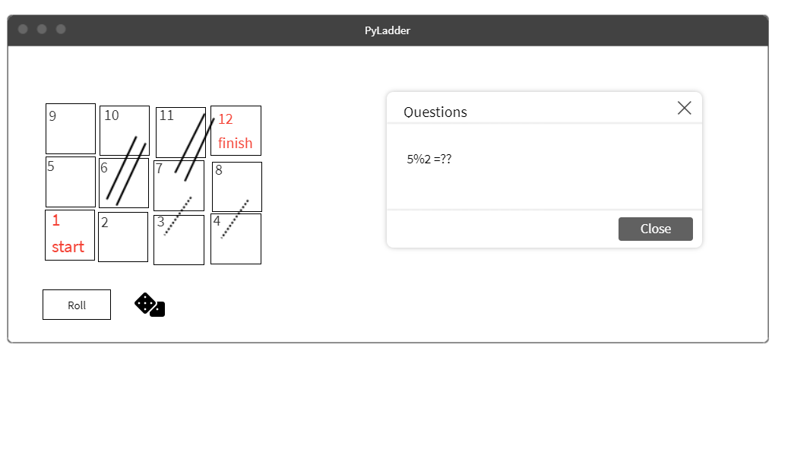
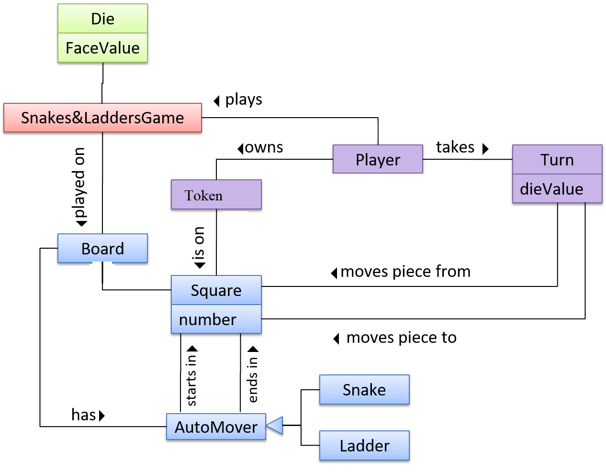

## Project Name :
PyLadder

## Our Team Members:

- Maram Ankir
- Mohammad khaled talafha
- Yousef Jalboush
- Omar D'yab
- Dina Albarghouthi

# Summary :

The game is a combination between learning math and "Snakes and ladders", or as we call it Pyladder, the idea is to make an interactive game with three different levels (easy, medium, hard), whenever a player faces a ladder or a snakehead a math question pops up depending on the mode, for instance, an easy math question is shown if the mode is easy and so on, if the answer is correct its easier to win the game, the player who crosses the last position wins.  

# Wireframe

# User stories:
[User stories](https://github.com/orgs/pythoneer-team/projects/1
)

# Domain modeling: 

#### Using a Database: our app does not have a database. 

