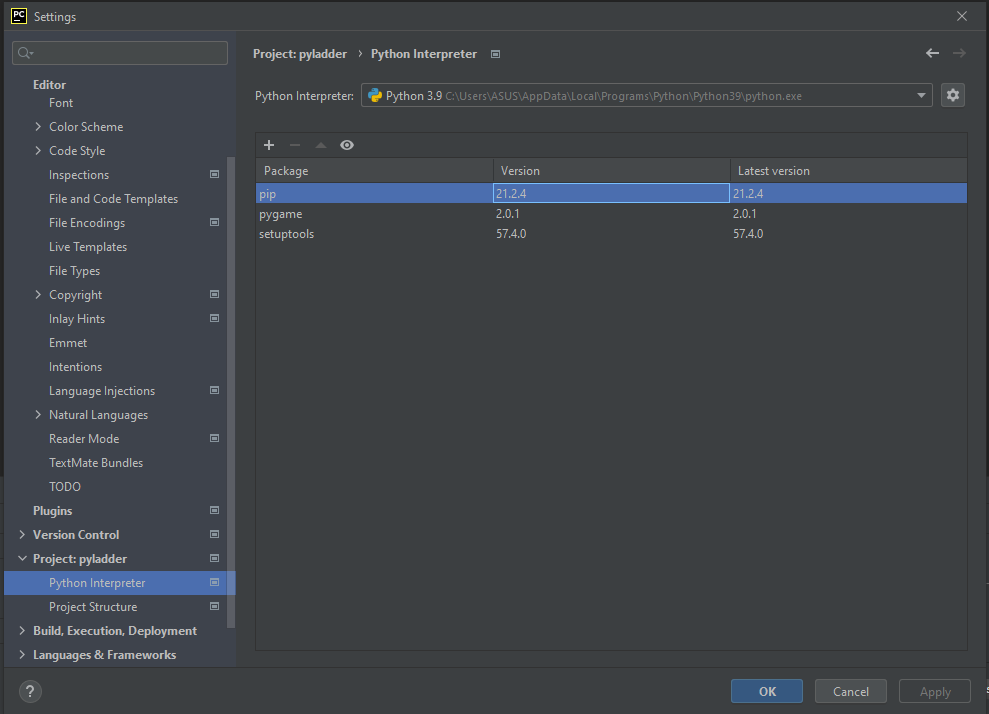
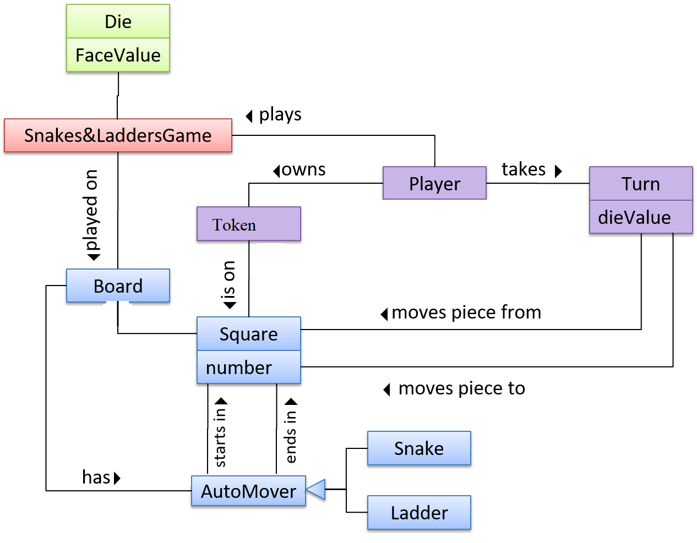

## Project Name :
PyLadder

## Our Team Members:

- Maram Ankir
- Mohammad Khaled Talafha
- Yousef Jalboush
- Omar D'yab
- Dina Albarghouthi

# Summary :

The game is a combination between learning math and "Snakes and ladders", or as we call it Pyladder, the idea is to make an interactive game with three different levels (easy, medium, hard), whenever a player faces a ladder or a snakehead a math question pops up depending on the mode, for instance, an easy math question is shown if the mode is easy and so on, if the answer is correct its easier to win the game, the player who crosses the last position wins.  

# Run and deploy our code:

* Linux users:
    - Download Python from the official website of Python: [Download Here](https://www.python.org/downloads/)
    - Download PyCharm from the official website of PyCharm: [Download Here](https://www.jetbrains.com/pycharm/download/#section=linux)
    - Clone our Repo and open it using PyCharm.
    - Follow the instructions to install Pygame [Download Here](https://www.pygame.org/wiki/GettingStarted)
    - Go to the following path [pyladder.py](pyladder/pyladder/pyladder.py) and Run it to play the game.

* Windows users:
    - Download Python from the official website of Python: [Download Here](https://www.python.org/downloads/)‏
    - Download PyCharm from the official website of PyCharm: [Download Here](https://www.jetbrains.com/pycharm/download/#section=windows)
    - Clone our Repo and open it using PyCharm.
    - Make sure to install the following packages:
    
    - Go to the following path [pyladder.py](pyladder/pyladder/pyladder.py) and Run it to play the game.

# Wireframe

# User stories:
[User stories](https://github.com/orgs/pythoneer-team/projects/1)

# Domain modeling: 

#### Using a Database: our app does not have a database. 

